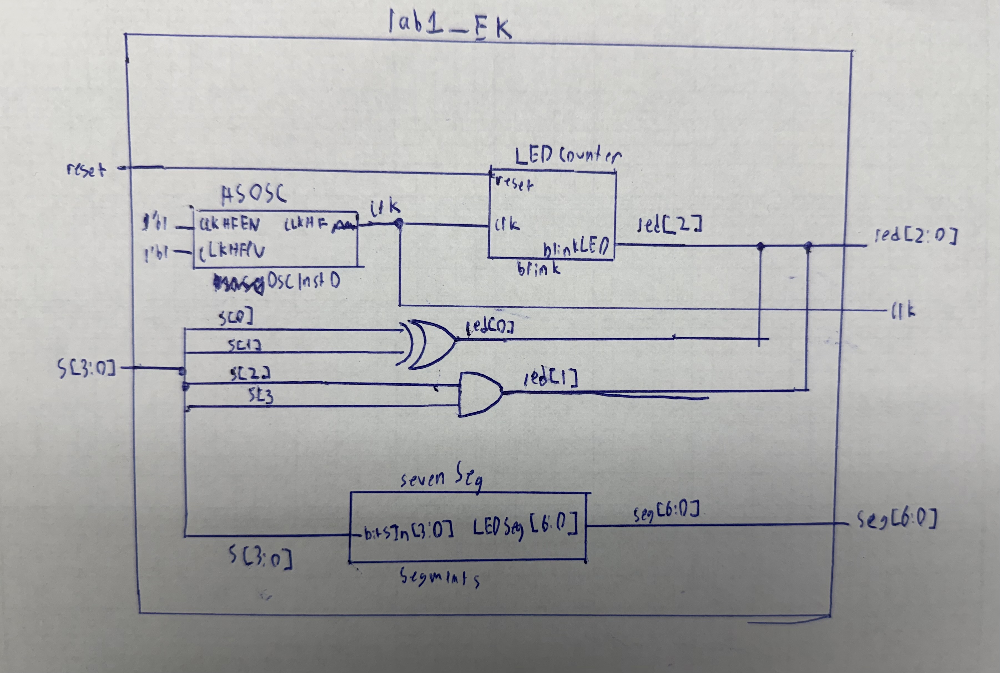
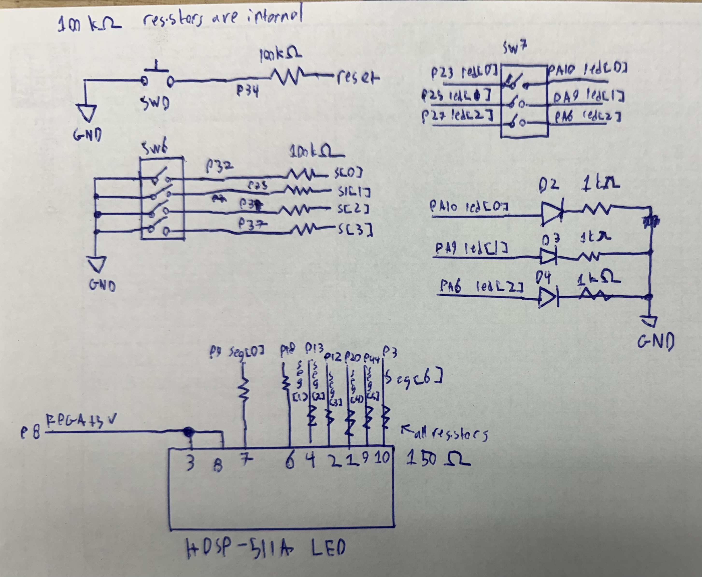
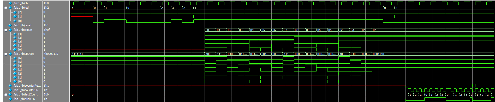
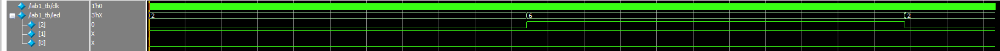
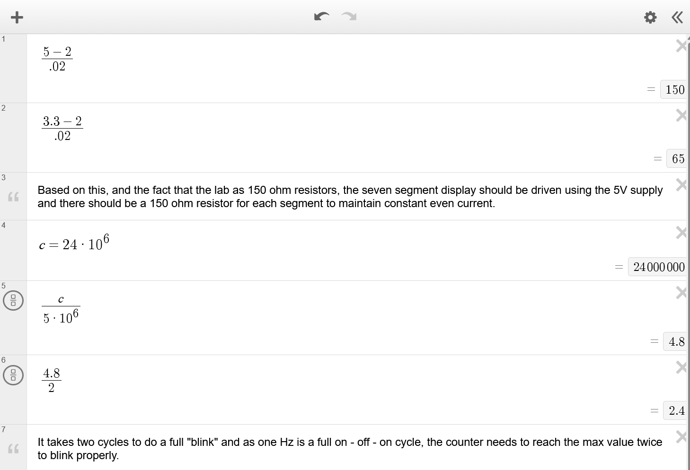

## Introduction

In this lab, the microPs dev board was assembled and a design was implemented on the FPGA to perform 3 tasks. The first task was to illuminate two of the on-board LED corresponding to combinational logic based on the state of 4 on board switches. The first LED was to be illuminated based on an XOR that took in the states of switches 0 and 1. The second LED was to be illuminated based on an AND that took in the states of switches 2 and 3. The second task was to blink one of the on-board LEDs at a frequency of 2.4Hz using the on-board high-speed oscillator. The third task was to illuminate a seven segment display with a number corresponding to the state of the 4 on-board switches. The high speed oscillator was configured at a frequency of 24 MHz and divided down using a counter to achieve a blinking frequency of 2.4 Hz.

## Design and Testing Methodology

For the combinational LEDs, one-line assign statements were used to implement the logic for the LEDs. This was tested in simulation using an automated test bench that tried all possible combinations of the 4 switches and checked that the correct LEDs were illuminated.

::: {.callout-note title="Combinational LEDs Code" collapse="true"}
```text
//led[0] equates to a XOR of switches 0 and 1
assign led[0] = s[0] ^ s[1];
//led[1] equates to an AND of switches 2 and 3
assign led[1] = s[2] && s[3];
```
:::

The on-board high-speed oscillator (`HSOSC`) from the iCE40 UltraPlus primitive library was used to generate a clock signal at 24 MHz.
Then, a 23-bit 5,000,000 max counter was used to divide the high frequency clock signal down so that the blinking frequency would be at 2.4Hz. See calculations section for how 5,000,000 was derived. The function was parametrized, so alternative versions could be used to achieve different blinking frequencies. This was tested in simulation using an automated test bench that confirmed that the counter was counting correctly, the LED would illuminate at the right time, and that the counter would reset after reaching the max value and when the reset switch was pressed.

The seven segment display was implemented using an always_comb case block that used the input from the 4 switches as a 4-bit hexadecimal number and converted each number to the corresponding 7-bit output for the seven segment display. This was tested in simulation using an automated test bench that tried all possible combinations of the 4 switches and checked that the correct segments were illuminated.

::: {.callout-note title="Seven Segment always_comb Block" collapse="true"}
```text
always_comb
begin
    case(bitsIn)
        4'h0: LEDSeg = ~(7'b0111111);
        4'h1: LEDSeg = ~(7'b0000110);
        4'h2: LEDSeg = ~(7'b1011011);
        4'h3: LEDSeg = ~(7'b1001111);
        4'h4: LEDSeg = ~(7'b1100110);
        4'h5: LEDSeg = ~(7'b1101101);
        4'h6: LEDSeg = ~(7'b1111101);
        4'h7: LEDSeg = ~(7'b0000111);
        4'h8: LEDSeg = ~(7'b1111111);
        4'h9: LEDSeg = ~(7'b1101111);
        4'hA: LEDSeg = ~(7'b1110111);
        4'hB: LEDSeg = ~(7'b1111100);
        4'hC: LEDSeg = ~(7'b0111001);
        4'hD: LEDSeg = ~(7'b1011110);
        4'hE: LEDSeg = ~(7'b1111001);
        4'hF: LEDSeg = ~(7'b1110001);
        default: LEDSeg = ~(7'b0000000);
    endcase
end
```
:::

Lastly, the overall design was tested in simulation using an automated test bench that confirmed that sending the correct inputs to the top level module would result in the correct outputs for the LEDs and seven segment display.

## Technical Documentation

The source code for the project can be found in the associated [Github repository](https://github.com/EnzoKatzen/ENGR-155-Lab-1).

### Block Diagram

::: {#fig-block-diagram}


Block diagram of the Verilog design.
:::

The block diagram in @fig-block-diagram demonstrates the overall architecture of the design.
The top-level module `lab1_EK` includes three submodules: the high-speed oscillator block (`HSOSC`), the seven segment display module (`sevenSeg`), and the counter module (`clk_divider`).

### Schematic

::: {#fig-schematic}


Schematic of the physical circuit.
:::

@fig-schematic shows the physical layout of the design.
Internal 100 k$\Omega$ pullup resistors were used on all inputs to ensure the pins would not be floating.
The on board LEDs were connected using a 1 k$\Omega$ current-limiting resistor to ensure the output current (~2.6 mA) did not exceed the maximum output current of the FPGA I/O pins. The seven segment displays were connected using a 150 $\Omega$ current limiting resistor to ensure the output current matches their specifications. A resistor was needed for each segment to maintain even current (and brightness) across all segments. The maximum current draw from the seven segment display was 140 mA, which is below the maximum current draw of 200 mA for the FPGA supply pins. The resistor values are derived in @fig-calculations.

## Results and Discussion

This design was able to achieve all tasks. In both simulation and on the physical FPGA, the combinational logic for the LEDs worked as intended, the blinking LED illuminated at a frequency of 2.4 Hz, and the seven segment display correctly displayed the hexadecimal number corresponding to the state of the 4 switches. However, something to note is that using more than one seven segment display would overwhelm the maximum current draw of the FPGA supply pins, so an additional power supply would be necessary.

### Testbench Simulation

@fig-testbench shows the results of the QuestaSim simulation, and @fig-fullTestbench shows the top-level test of the blinking LED over its full time scale.

::: {#fig-testbench}


A screenshot of a QuestaSim simulation showing the combinational LEDs and the seven segment display functioning as intended both when tested as submodules and when tested as part of the top-level module. The blinking LED was tested as a submodule and worked properly, but its test as part of the top-level was over a much longer time scale and is shown in the hidden screenshot below.
:::

:::: {.callout-note title="Top Level Testbench Simulation of Blinking LED" collapse="true"}
::: {#fig-fullTestbench}


A screenshot of a QuestaSim simulation showing the blinking LED functioning as intended when tested as part of the top-level module.
:::
::::

::: {.callout-note title="Testbench Test Results" collapse="true"}
```text
# PASSED! The HSOSC generated clk behaves as desired at time: 42000.
# PASSED! The HSOSC generated clk behaves as desired at time: 63000.
# PASSED! The led controller behaves as desired at time: 125000.
# PASSED! The led controller behaves as desired at time: 167000.
# PASSED! The led controller behaves as desired at time: 208000.
# PASSED! The led controller behaves as desired at time: 250000.
# PASSED! The led controller behaves as desired at time: 292000.
# PASSED! The led controller behaves as desired at time: 333000.
# PASSED! The led controller behaves as desired at time: 375000.
# PASSED! The led controller behaves as desired at time: 417000.
# PASSED! The led controller behaves as desired at time: 458000.
# PASSED! The led controller behaves as desired at time: 500000.
# PASSED! The seven segment display controller behaves as desired at time: 542000.
# PASSED! The seven segment display controller behaves as desired at time: 583000.
# PASSED! The seven segment display controller behaves as desired at time: 625000.
# PASSED! The seven segment display controller behaves as desired at time: 667000.
# PASSED! The seven segment display controller behaves as desired at time: 708000.
# PASSED! The seven segment display controller behaves as desired at time: 750000.
# PASSED! The seven segment display controller behaves as desired at time: 792000.
# PASSED! The seven segment display controller behaves as desired at time: 833000.
# PASSED! The seven segment display controller behaves as desired at time: 875000.
# PASSED! The seven segment display controller behaves as desired at time: 917000.
# PASSED! The seven segment display controller behaves as desired at time: 958000.
# PASSED! The seven segment display controller behaves as desired at time: 1000000.
# PASSED! The seven segment display controller behaves as desired at time: 1042000.
# PASSED! The seven segment display controller behaves as desired at time: 1083000.
# PASSED! The seven segment display controller behaves as desired at time: 1125000.
# PASSED! The seven segment display controller behaves as desired at time: 1167000.
# PASSED! The seven segment submodule connection behaves as desired at time: 1208000.
# PASSED! The seven segment submodule connection behaves as desired at time: 1250000.
# PASSED! The counter submodule behaves as desired at time: 1260000.
# PASSED! The counter submodule behaves as desired at time: 1330000.
# PASSED! The counter submodule behaves as desired at time: 1410000.
# PASSED! The counter submodule behaves as desired at time: 1510000.
# PASSED! The counter submodule behaves as desired at time: 1580000.
# PASSED! The counter submodule connection behaves as desired at time: 208334914000.
# PASSED! The counter submodule connection behaves as desired at time: 416668248000.
```
:::

## Conclusion

The dev board was assembled properly and the FPGA design successfully drove LEDs based on combinational logic, blinked an external LED using the on-board high-speed oscillator at 2.4 Hz, and controlled a seven segment display.

I spent a total of ten hours working on this lab, but a significant (>3 hrs) amount of time was spent getting Lattice Radiant to work properly.

## Calculations

:::: {.callout-note title="Resistor and Counter Calculations" collapse="true"}
::: {#fig-calculations}


Calculations for the current-limiting resistor values and the counter maximum used to divide the 24 MHz clock down to 2.4 Hz.
:::
::::

## AI Prototype Summary

::: {.callout-note title="AI Generated Code" collapse="true"}
```text
module led_blink #(
    parameter int unsigned CLK_FREQ_HZ = 48_000_000,
    parameter int unsigned BLINK_HZ    = 2
) (
    output logic led
);

    // Toggle the LED every half-period.
    localparam int unsigned HALF_PERIOD =
        CLK_FREQ_HZ / (2 * BLINK_HZ);

    // Width automatically sized for the required count.
    localparam int unsigned COUNTER_WIDTH =
        (HALF_PERIOD <= 1) ? 1 : $clog2(HALF_PERIOD);

    logic clk;
    logic [COUNTER_WIDTH-1:0] counter;

    // Lattice iCE40 UltraPlus internal high-frequency oscillator.
    HSOSC #(
        .CLKHF_DIV(2'b00)       // 48 MHz
    ) hfosc (
        .CLKHFPU(1'b1),          // Power up oscillator
        .CLKHFEN(1'b1),          // Enable clock output
        .CLKHF  (clk)
    );

    // Divide 48 MHz down to a 2 Hz LED blink.
    always_ff @(posedge clk) begin
        if (counter == HALF_PERIOD - 1) begin
            counter <= '0;
            led     <= ~led;
        end
        else begin
            counter <= counter + 1'b1;
        end
    end

endmodule
```
:::

I used the free non-signed-in version of ChatGPT to generate this code using the provided LLM prompt. Initially the code did not compile due to it assuming that I was using "Yosys/nexpnr", which lead it to use SB_HFOSC instead of HSOSC. However, after I specified that I was using Lattice Radiant, it switched it to using the correct HSOSC module. This was able to successfully synthesize and implement on the FPGA, and the LED blinked at the correct frequency.

I would say that is code is of fairly decent quality. It comments well, uses descriptive variable names, and uses cohesive capitalization and formatting. However, it over defines many variables, and seems to be overcomplicated for the task at hand. It used some things that I had never seen before, such as using underscores as commas to make large numbers more readable, localparams, and the $clog2 function. If I were to use an LLM in my workflow, I would give it clear instructions of how I want it to achieve the task. This way the LLM will not overcomplicate the code and will act as a helper that can write the easy parts of the code while I focus on the more difficult parts.