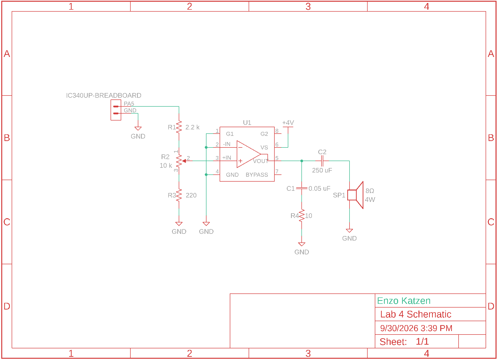
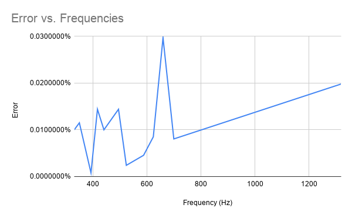
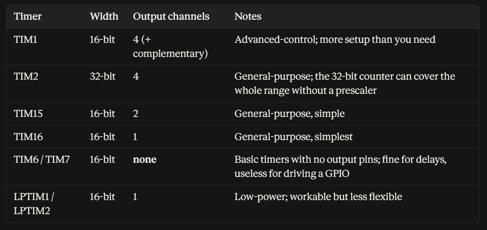

## Introduction

In this lab, the a STM32L432KC MCU was used to play music on a basic speaker. Music was provided as a 2D integer array containing the notes frequency in Hz in the first column, and the note length in ms in the second column. Rests were provided as notes with a frequency of 0 Hz. Based on this, we had to wrote code an design a circuit that would play the music without damaging the MCU's GPIO pins. Additionally, a potentiometer was implemented to adjust volume. 

## Design and Testing Methodology

For the delays, a timer was set to overflow at a rate of 1 KHz as the length of all inputs was in ms. As the onboard MSI generated a signal at 4 MHz, it was divided using TIM6 down to 1 KHz. This was tested using an oscilloscope to confirm that notes lasted as long as they were described in code.

::: {.callout-note title="Delay Code" collapse="true"}
```text
void msDelay(int ms, bool rest) {
    while(--ms >= 0) {
        //will be high once every ms
        while (!(TIM6->SR)){
            //only pin when it is not a rest
            if((TIM7->SR) & (!rest)){
                togglePin(OUT_PIN);
                //reset flag as it needs to be done manually
                TIM7->SR &= (0);
            }
        }
        //reset flag as it needs to be done manually
        TIM6->SR &= (0);  
   }
}
```
:::

For the notes themselves, a similar structure of using a timer to divide the 4MHz MSI clock was used. For this, TIM7 was used. To prevent dividing by 0, the code first checked that the frequency of a note was not 0 before calculating the counter needed to achieve this frequency. For both the delay and the frequency, the status register was used to evaluate when the counter had overflowed. This was tested by setting a long duration note to a known frequency, and using an oscilloscope to confirm that the outputted frequency matched.

::: {.callout-note title="Note Code" collapse="true"}
```text
bool setFreq(int freq){
    //Frequency 0 means the note is rest
    if(freq == 0){
        //don't output power during a rest
        digitalWrite(OUT_PIN, 0);
        return true;
    }else{
        //See calculations for math
        uint16_t counter = CLOCK_FREQUENCY / (2*freq);
        TIM7->ARR = counter-1;
        //Counter could be greater than ARR, and it only roles over when "counter reaches the overflow [ARR]"
        TIM7->CNT = 0;
        //Flag could become high during a rest and wouldnot be reset
        TIM7->SR &= (0);
        return false;
    }
}
```
:::
The electronics were designed according to the schematics shown in the amplifiers datasheet. However, a ~10x voltage divider (see calculations) was implemented around a 10 K ohm potentiometer to gain more accuracy in volume control. The electronics were tested using a 8 ohm resistor to prevent overpowering the speaker.

Lastly, the overall design was tested in practice by using a speaker to confirm everything sounded accurate.

## Technical Documentation

The source code for the project can be found in the associated [Github repository](https://github.com/EnzoKatzen/ENGR-155-Lab-4).

### Schematic

::: {#fig-schematic}


Schematic of the physical circuit.
:::


### Implementation Documentation

::: {#fig-errorGraph}


Graph showing % error vs frequency of each note
:::
This design is able to play frequencies from 30.52 Hz to 2000000 Hz, and will not encounter a >= 1% error with any frequencies under 20000 Hz. Additionally, @fig-errorGraph clearly shows how this design will play all notes of Fur Elise with a significantly <1% error. It can play notes of any length from 0 - 65535 ms. Checking at 220 Hz and 1000 Hz is not sufficient to show that all notes are within error bounds as 1000 Hz has an error of 0% and 220 Hz has an error of 0.01%, while the maximum error among all notes is 0.0297%. As the maximum error is far higher than those at either 1000 Hz or 200 Hz, just checking those is not sufficient.

## Results and Discussion

This design was able to achieve all tasks. Both mathematically and in the final implementation, the code was able to accurately translate inputted code into accurate sounds. Fur Elise sounded accurate, and the additional song I implemented also sounded correct. The potentiometer based volume control I implemented also worked. However, for an unknown reason my circuit has some amount of audio distortion. I have confirmed this is not due to my code as if I put my MCU on other students boards, audio plays without distortion. Additionally, only a fraction of my potentiometer actually adjusts volume, and increasing it or decreasing it beyond that range either results in no increase in volume or the speaker not playing.

## Conclusion

The MCU was properly programmed and the circuit was properly assembled, resulting in a design that was able to play music based on inputs and control volume via a potentiometer.

I spent a total of twelve hours working on this lab.

## Calculations

Calculations for the error, maximum and minimum frequencies and delay lengths, and the voltage divider can be found in this spreadsheet: [Lab 4 Calculations](https://docs.google.com/spreadsheets/d/159cZQWkQmnJzNAv55zveGSCvQ6ZP7RSPB9wTwZFsCWw/edit?usp=sharing)

## AI Prototype Summary
I used the Claude Pro set to Opus 5.5 with medium effort for these responses. 

Without giving the LLM the datasheet, it generated a very clear, thought out, and accurate response in under 45 seconds. It described each timer, its advantages and drawbacks, and formatted the information in a readable chart @fig-aiChart. From there, it walked me through its decision of a timer, wrote out all relevant formulae, described the purpose of each, and gave an example. From there, it not just wrote out the relevant registers, but what they should be set to, and example code. This code was very similar to my setup, and even used bitwise logic to accurately set bits like I did in my code. Its reasoning was different than mine as it prioritized using a timer that could output directly to GPIO pins without additional setup, while I focused on using a similar timer and building on top of that in code. Overall, the LLM seemed to be far better at this than writing HDL code, and was much faster than going through the datasheet myself.

::: {.callout-note title="Table Generated Without Datasheet" collapse="true"}
::: {#fig-aiChart}


:::
:::

I repeated the same prompt, but gave the LLM the datasheet, and it failed as the reference manual was too large. However, as the answers generated without the manual were already very accurate and detailed, I think giving it the manual would not have been helpful as it would have just slowed it down to process the new context.