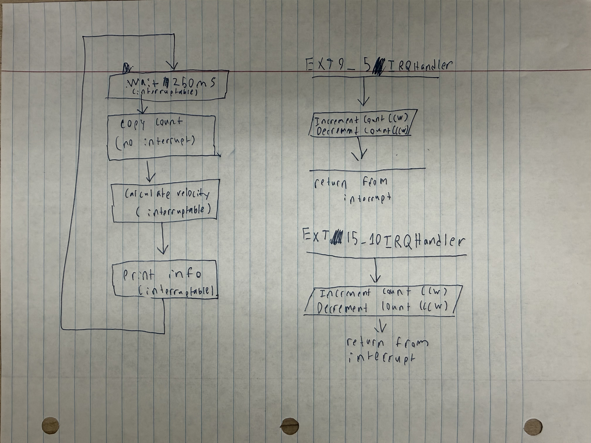
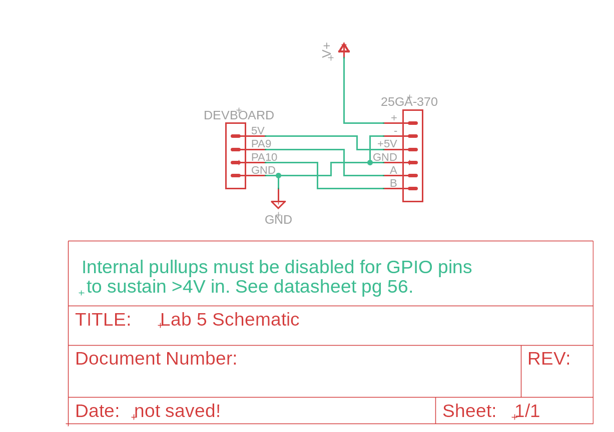

## Introduction

In this lab, a STM32L432KC MCU was used to determine the speed of a motor. This was done by reading from a quadrate encoder using interrupts. From this, we had to calculate the direction and speed at which the motor was turning. To do so, we had to wrote code an design a circuit that would power the motor and encoder without damaging the MCU's GPIO pins. 

## Design and Testing Methodology

First, the overall 16MHz clock was enabled before initializing the registers needed for the interrupts. From there, input pin was configured to have interrupts enabled using a function that would calculate register offsets on a per pin basis. 

::: {.callout-note title="Pin Offset Enable Code" collapse="true"}
```text
//I put a fair bit of time into making this ultra flexible as I have a feeling having a good interrupt function will be very helpful
void extiEnableBothEdges(int gpio_pin) {
	int line = gpioPinOffset(gpio_pin);
	int exticr_index = line / 4;	    //4 pin lines in each EXTICR register
	int exticr_shift = 4 * (line % 4);	//4 bits of registers per pin line (but only 3 are actually set)
	uint32_t line_mask = 1u << line;	//make a mask for the registers in EXTI
	uint32_t exticr_field_mask = 0b111u << exticr_shift; //make a mask for the 3 bits in the SYSCFG->EXTICR register for each pin
	uint32_t exticr_port_code = (uint32_t) gpioPinToPort(gpio_pin) << exticr_shift; //Get which port, we are using, and enbale for that port 

	RCC->APB2ENR |= RCC_APB2ENR_SYSCFGEN; //turn on clk for interrupts

	SYSCFG->EXTICR[exticr_index] &= ~exticr_field_mask;	//Use mask to clear existing data
	SYSCFG->EXTICR[exticr_index] |= exticr_port_code;	//Set the interrupt to point at right port

	EXTI->RTSR1 |= line_mask;	//Turn on for rising edge
	EXTI->FTSR1 |= line_mask;   //Turn on for falling edge
	EXTI->PR1 = line_mask;		//Reset any flags
	EXTI->IMR1 |= line_mask;	//unmask so we can see what is happening
}

//Looking at an example makes this more sensible: extiEnableBothEdges(PA9)
//line				= 9				PA9 is pin 9 of port A, so enable it using EXTI line 9
//exticr_index			= 9 / 4 = 2			Pin line 9 is set in EXTICR3, but as arrays start at 0, that is EXTICR[2]
//exticr_shift			= 4 * (9 % 4) = 4               Pin line 9 is bits 6:4 of the right EXTICR register
//line_mask                     = 1 << 9 = 0x200                Bit 9 in IMR1, RTSR1, FTSR1, and PR1
//exticr_field_mask             = 0b111 << 4			mask on bits 6:4
//exticr_port_code              = 0 << 4 = 0			Port A code is 000
//
//Result:
//EXTICR[2] bits 6:4 = 000                                      Line 9 now comes from port A (GPIO pins A)
//RTSR1 bit 9 = 1                                               Trigger on rising edge
//FTSR1 bit 9 = 1						Trigger on falling edge
//PR1 bit 9 cleared                                             Reset any interrupts
//IMR1 bit 9 = 1	
```
:::

After that is completed, the code enters the main loop, which loops waiting for 250ms before calculating the speed of the motor and the direction it was turning. This main loop is depicted in @fig-flowchart.

::: {#fig-flowchart}


Flowchart depicting the main loop.
:::

At any point during this main loop - except for when a few variables are being copied - the process can be interrupted by the two interrupts: one for each pin of the encoder. During the interrupt, the motor direction is identified, and based on the direction, a count variable is either incremented or decremented. Following that point, the main loop is continued from where it was left off.

::: {.callout-note title="Interrupt Code" collapse="true"}
```text
void EXTI9_5_IRQHandler(void) {
	uint32_t a_line_mask = 1u << gpioPinOffset(ENCODER_A_PIN); //mask for that specific pin
	if (EXTI->PR1 & a_line_mask) {
		// Clear first (write 1 to reset) so an edge during handling re-triggers
		EXTI->PR1 = a_line_mask;

		if (digitalRead(ENCODER_A_PIN) != digitalRead(ENCODER_B_PIN)) {
			recordEdge(1);	//If they don't equal, then A moved away from B, so that means A leads, so it is going forward
		} else {
			recordEdge(-1);	//If they do equal, then A caught up to B, so that means B leads, so it is going backwards
		}
	}
}

//Encoder B input (EXTI lines 10-15)
void EXTI15_10_IRQHandler(void) {
	uint32_t b_line_mask = 1u << gpioPinOffset(ENCODER_B_PIN);
	if (EXTI->PR1 & b_line_mask) {
		EXTI->PR1 = b_line_mask;

		if (digitalRead(ENCODER_A_PIN) == digitalRead(ENCODER_B_PIN)) {
			recordEdge(1);	//If they do equal, then B caught up to A, so that means A leads, so it is going forward
		} else {
			recordEdge(-1);	//If they don't equal, then B moved away from A, so that means B leads, so it is going backwards
		}
	}
}
```
:::

The electronics were designed in a very basic manner which is depicted in the schematic. One thing to note is that for the FT pins to sustain a greater than 4V input, their internal pullups must be disabled.

Lastly, the overall design was tested in practice by using an oscilloscope to determine the true motor speed and comparing the program output to that.

## Technical Documentation

The source code for the project can be found in the associated [Github repository](https://github.com/EnzoKatzen/ENGR-155-Lab-5).

### Schematic

::: {#fig-schematic}


Schematic of the physical circuit.
:::


### Implementation Documentation
Raw encoder pulses are converted to rev/s through a multi-step process. First, during the interrupt, it is calculated whether the pulse that was sent means that the motor is spinning clockwise (CW) or counterclockwise (CCW). If CW, then a counter is incremented, and if CCW, then the counter is decremented. Then, at the end of the main loop, if there was a pulse during the last 250ms, the counter is divided by the pulses per revolution times 4, as there are 4 edges (2 for A and 2 for B) per each pulse. This gives the rev/s. Additional code is used for if there was no pulse in the last 250ms, no pulse in the last 1s, and the motor starting from there being no pulses.

My implementation used interrupts instead of polling. This is because polling has the potential to miss a significant number of inputs while it is running through various of segments of code. Using my implementation, there is at most an 18 us span at which a signal could be missed, but with a polling based implementation of my code, that extends to 237 us. For that reason, a polling based approach could be considered to be less effective. However, interrupt based approaches introduce other issues, like significantly more code complexity, higher code overhead, and require far more developed MCUs, which adds significant cost.

## Calculations
To the counter value to rev/s, I first identified how many pulses would be put out from one rotation: $P_{PR} = 120$. Then, I calculated the number of edges per rotation $E_{PR} = P_{PR} * 4$. That is how much my counter will increment per rotation. Once I know that, I can calculate rev/s by dividing my counter by $E_{PR}$.

To evaluate the update rate of my implementation, I used Segger Embedded Studio to count the maximum number of clock cycles that could happen before an input would get recognized. Hypothetically, if I had just gotten an edge right as I was about to copy my end of cycle data, and instantly afterwards I got another edge, it would take a total of 285 clock cycles (12 from the base MCU interrupt delay, 255 from my interrupt analysis, and 18 from the end of cycle copying) until I could see the next signal. As the clock is running at 16 MHz, then each clock cycle takes 0.0625 us, and means that the resolution of my implementation is, at its worst, 18 us between interrupts.

Comparatively, the alternative polling implementation could have a delay of 3787 clock cycles, which with the clock running at 16 MHz, equates to a possible worst-case resolution of 237 us between interrupts. 

## Results and Discussion
This design was able to achieve all tasks. Both mathematically and in the final implementation, the code was able to accurately translate inputs from the encoder into the speed and direction a motor was spinning. Additionally, my interrupt based implementation performed favorably when compared to a polling based implementation, but the complexity of my implementation may cause some issues. Additionally, my circuit was designed to use the proper 5V capable GPIO pins, and disabled the internal pullup resistors to ensure the datasheet was adhered to.

## Conclusion

The MCU was properly programmed and the circuit was properly assembled, resulting in a design that was able to recognize which direction and how fast a motor was spinning.

I spent a total of 10 hours working on this lab.

## AI Prototype Summary
I used the Claude Pro set to Opus 5.5 with medium effort for these responses. 

The LLM performed quite well, generating a valid selection of pins and code that successfully was able to read from the encoder. It did choose different pins than I did, but this was not due to any issues on the part of the LLM, it simply didn't have the full context of the dev board. The code was functional, but it was difficult to interpret, even with my C++ experience. For example, it mapped the input from the GPIO pins onto a 2D array, which worked, but was very difficult for me to understand. It also used a lot of registers without many comments, which worked, but made it a little difficult to understand what was happening.

Overall, due to the LLM's ability to write functional code very quickly, it makes a lot of sense to use it as a sounding board. It would let me rapidly figure out register maps and how to structure my code, but I might want to actually write my code or give it strict commenting instructions to prevent it from writing hard to interpret code.

::: {.callout-note title="AI Code" collapse="true"}
```text
    static const int8_t qdec_table[16] = {
        0, -1, +1,  0,
        +1,  0,  0, -1,
        -1,  0,  0, +1,
        0, +1, -1,  0
    };
------------------------------------------------------------------------------
    void encoder_init(void)
    {
        /* Clocks: GPIOA and SYSCFG (SYSCFG owns the EXTI port mux) */
        RCC->AHB2ENR |= RCC_AHB2ENR_GPIOAEN;
        RCC->APB2ENR |= RCC_APB2ENR_SYSCFGEN;

        /* PA9, PA10 as inputs (MODER = 00). Reset value on L4 is analog (11),
        so this must be cleared explicitly. */
        GPIOA->MODER &= ~(GPIO_MODER_MODE9 | GPIO_MODER_MODE10);

        /* Pull-ups (PUPDR = 01). Needed for open-collector encoders; harmless for
        push-pull ones. Remove if your board has external pull-ups. */
        GPIOA->PUPDR &= ~(GPIO_PUPDR_PUPD9 | GPIO_PUPDR_PUPD10);
        GPIOA->PUPDR |=  (GPIO_PUPDR_PUPD9_0 | GPIO_PUPDR_PUPD10_0);

        /* Route EXTI9 and EXTI10 to port A (000 = PA). Both live in EXTICR3,
        which is EXTICR[2] in CMSIS. */
        SYSCFG->EXTICR[2] &= ~(SYSCFG_EXTICR3_EXTI9 | SYSCFG_EXTICR3_EXTI10);

        /* Unmask, trigger on both rising and falling edges */
        EXTI->IMR1  |= EXTI_IMR1_IM9  | EXTI_IMR1_IM10;
        EXTI->RTSR1 |= EXTI_RTSR1_RT9 | EXTI_RTSR1_RT10;
        EXTI->FTSR1 |= EXTI_FTSR1_FT9 | EXTI_FTSR1_FT10;

        /* Clear anything pending, capture the starting state */
        EXTI->PR1 = EXTI_PR1_PIF9 | EXTI_PR1_PIF10;
        enc_state = enc_read_pins();
        enc_count = 0;

        /* SAME priority for both so neither ISR can preempt the other mid-update
        of the shared enc_state/enc_count. */
        NVIC_SetPriority(EXTI9_5_IRQn,   ENC_IRQ_PRIORITY);
        NVIC_SetPriority(EXTI15_10_IRQn, ENC_IRQ_PRIORITY);
        NVIC_EnableIRQ(EXTI9_5_IRQn);
        NVIC_EnableIRQ(EXTI15_10_IRQn);

        __enable_irq();
    }
```
:::
